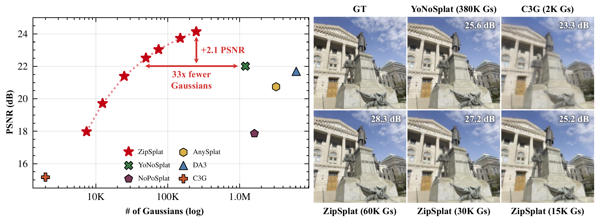

<p align="center">
  <h1 align="center">ZipSplat: Fewer Gaussians, Better Splats</h1>
  <p align="center">
    <a href="https://veichta.com">Alexander Veicht</a>
    &middot; <a href="https://sunghwanhong.github.io">Sunghwan Hong</a>
    &middot; <a href="https://scholar.google.com/citations?user=U9-D8DYAAAAJ">D&aacute;niel Bar&aacute;th</a>
    &middot; <a href="https://people.inf.ethz.ch/marc.pollefeys/">Marc Pollefeys</a>
    <br>
    <sub>ETH Z&uuml;rich &nbsp;&middot;&nbsp; Microsoft</sub>
  </p>
  <p align="center">
    <a href="https://arxiv.org/abs/2606.05102">Paper</a>
    |
    <a href="https://veichta.com/zipsplat">Project Page</a>
  </p>
</p>

<p align="center">
  
  <br>
  <em>ZipSplat decouples Gaussian placement from the pixel grid, reconstructing a scene from a few
  unposed images in under a second, with higher quality from far fewer Gaussians.</em>
</p>

---

ZipSplat is a feed-forward model for 3D Gaussian Splatting: it reconstructs a scene from a few
unposed images in a single forward pass, with no poses, intrinsics, or per-scene optimization.
Instead of emitting one Gaussian per pixel, it compresses the input views into a compact set of
scene tokens and decodes each into a small group of Gaussians, reaching state-of-the-art quality
with far fewer Gaussians and a single knob to trade quality for size. This repository hosts the
[inference](#inference), [evaluation](#evaluation), and [training](#training) code for ZipSplat,
together with our pretrained weights.

## Setup and demo

We provide a standalone inference package [`zipsplat`](zipsplat) that requires only minimal
dependencies and Python >= 3.10. First clone the repository and install it:

```bash
git clone https://github.com/cvg/ZipSplat.git && cd ZipSplat
python -m pip install -e .
# optional: xformers' fused SwiGLU kernel the released checkpoint was trained with (small speedup)
python -m pip install -e ".[xformers]"
```

Rendering uses [gsplat](https://github.com/nerfstudio-project/gsplat) and requires a CUDA GPU; the
pretrained weights are downloaded automatically on first use.

The easiest way to try ZipSplat is the interactive viewer: reconstruct a scene and explore it live
in your browser. Drag the **compression** slider to trade Gaussians for quality in real time, and
toggle **token coloring** to see how each token's group of Gaussians is placed:

```bash
pip install "zipsplat[viewer]"
python -m zipsplat.viewer assets/examples/drone.mp4   # or assets/examples/office/, or your own dir/glob/video
```

## Inference

Here is a minimal usage example:

```python
import math, torch
from zipsplat import ZipSplat, Camera, Pose, load_image, viz

model = ZipSplat(weights="zipsplat").cuda().eval()
images = [load_image(p) for p in paths] # raw images, any size (auto-resized)
gaussians = model(images)[0] # feed-forward 3D Gaussians

# render a novel view
camera = Camera.from_fov(math.radians(60), w=512, h=512)
pose = Pose.from_Rt(torch.eye(3), torch.zeros(3)) # identity pose
rgb, info = gaussians.render(camera, pose)

# export
gaussians.save_ply("scene.ply")                             # open in any 3DGS viewer
viz.turntable(gaussians, "turntable.mp4", sweep_deg=None)   # wiggle orbit video
```

`gaussians` is a [`Gaussians`](zipsplat/gaussians.py) object; `gaussians.save_ply(...)` writes a standard 3DGS `.ply` you can
drop into [SuperSplat](https://playcanvas.com/supersplat/editor) or any Gaussian-splat viewer.

<details>
<summary><b>Input: images, a video, or a single image</b></summary>

```python
from zipsplat import load_image, load_video

# multiple images (any sizes; center-cropped to square and resized internally)
gaussians = model([load_image(p) for p in paths])[0]

# a single image
gaussians = model([load_image("photo.jpg")])[0]

# a video clip (evenly samples num_frames across the clip)
gaussians = model(load_video("assets/examples/drone.mp4", num_frames=24))[0]
```

The model handles 1-24+ views; more views give wider coverage, fewer give a tighter reconstruction.
</details>

<details>
<summary><b>Compression: fewer Gaussians</b></summary>

`compression` is the query-sampling ratio in `(0, 1]`. `1.0` (default) uses every token; lower values
run k-means to keep a subset, shrinking the Gaussian count with graceful quality falloff.

```python
gaussians = model(images, compression=1.0)   # full quality
gaussians = model(images, compression=0.25)  # ~4x fewer Gaussians
print(gaussians.num_gaussians)
```
</details>

<details>
<summary><b>Rendering</b></summary>

```python
# a single view (scalar camera/pose) or a batch of views ([V])
rgb, info = gaussians.render(camera, pose)               # mode="RGB" by default
rgbd, _ = gaussians.render(camera, pose, mode="RGB+ED")  # append expected depth
```

Cameras/poses are moved to the scene's device automatically. `info["alphas"]` holds the rendered
opacity. Build cameras with `Camera.from_fov`, `Camera.from_focal`, or `Camera.from_K`.
</details>

<details>
<summary><b>Turntable video</b></summary>

```python
from zipsplat import viz

viz.turntable(gaussians, "orbit.mp4")                  # full 360-degree turntable
viz.turntable(gaussians, "wiggle.mp4", sweep_deg=None) # gentle wiggle (best for front-facing scenes)
```
</details>

<details>
<summary><b>Camera priors (optional)</b></summary>

If you have calibrated cameras and poses, pass them with `use_priors=True` to inject them into the
backbone. Intrinsics are adjusted automatically for the internal resize.

```python
gaussians = model(images, cameras=cameras, poses=poses, use_priors=True)
```
</details>

## Models

| Name       | Backbone  | Train res | Notes                                      |
| ---------- | --------- | --------- | ------------------------------------------ |
| `zipsplat` | DA3-Giant | 252 px    | Default release checkpoint (RE10K + DL3DV) |

Weights are hosted on the [Hugging Face Hub](https://huggingface.co/veichta/zipsplat) and fetched on
first use. You can also pass a local path or URL: `ZipSplat(weights="path/to/checkpoint.tar")`.

## Training and evaluation

The training and evaluation code lives in [`splatfactory`](splatfactory), a general library for
feed-forward Gaussian Splatting. It streams large multi-view datasets, composes models and
losses through Hydra configs, trains across multiple GPUs, and benchmarks novel-view synthesis on a
suite of standard datasets. ZipSplat is the model we train with it; the recipes below reproduce the
released checkpoint and the paper tables.

### Setup

`splatfactory` needs a CUDA toolchain to build two compiled extensions
([gsplat](https://github.com/JoannaCCJH/gsplat) for rasterization and
[fused-ssim](https://github.com/rahul-goel/fused-ssim) for the SSIM loss), so install in this order:

```bash
# from the repo root
conda create -n splatfactory python=3.12 -y && conda activate splatfactory
conda install -c nvidia cuda-toolkit -y                      # provides nvcc for the kernels below

# 1) torch first (CUDA build), then the training package + its core deps
pip install torch torchvision --index-url https://download.pytorch.org/whl/cu128
pip install -e splatfactory/

# 2) CUDA extensions need a built torch present, so disable build isolation
pip install --no-build-isolation --use-pep517 \
    git+https://github.com/JoannaCCJH/gsplat.git \
    git+https://github.com/rahul-goel/fused-ssim/
python -c "from gsplat.cuda._backend import _C"              # sanity check

# optional: xformers' fused SwiGLU kernel the released checkpoint was trained with
pip install -e "splatfactory/[xformers]"
```

We use a [gsplat fork](https://github.com/JoannaCCJH/gsplat) rather than upstream because it exposes
a per-Gaussian `activated` flag from the rasterizer. Training uses it to detach Gaussians that were
already rendered from the geometry (chamfer) loss, so that term only supervises the Gaussians the
images don't already constrain. Inference works with stock gsplat; this fork only matters for
training.

<details>
<summary><b>Preparing the data</b></summary>

Every dataset is converted into a common format: uncompressed tar shards of scenes (images,
cameras, poses, and optional depth) written under `data/<dataset>/<HxW>/{train,test}-scenes/`. The
shipped configs point `data.dataset_dir` at these paths, so the default commands below produce
exactly what training and evaluation expect. Each dataset has a `download` step (fetch the raw data)
and a `convert` step (pack it into shards); add `--num-workers N` to parallelize either. **For
evaluation you only need the test split**, so pass `--split test` to `convert` where available.

<details>
<summary><b>RE10K</b></summary>

A single archive (pixelSplat/MVSplat format) packed into shards at 360x640:

```bash
# download -> data/re10k/raw/re10k.zip
python -m splatfactory.datasets.scripts.re10k.download
# convert -> data/re10k/360x640/{train,test}-scenes
python -m splatfactory.datasets.scripts.re10k.convert --num-workers 8
# evaluation only: just the test split
python -m splatfactory.datasets.scripts.re10k.convert --split test
```
</details>

<details>
<summary><b>DL3DV</b></summary>

Gated on Hugging Face, so accept the dataset terms and run `huggingface-cli login` first. We use the
960P release (540x960). Redistribution is not permitted; the script pulls directly from Hugging Face
per the DL3DV terms.

```bash
# download -> data/dl3dv/raw/960P/<batch>/<hash>.zip  (one zip per scene)
python -m splatfactory.datasets.scripts.dl3dv.download --resolution 960P --num-workers 4
# convert -> data/dl3dv/540x960/{train,test}-scenes
python -m splatfactory.datasets.scripts.dl3dv.convert --resolution 960P --num-workers 8
# evaluation only: just the test split
python -m splatfactory.datasets.scripts.dl3dv.convert --resolution 960P --split test
```
</details>

<details>
<summary><b>MipNeRF360</b> (evaluation only)</summary>

A single ~3.6 GB archive, converted from COLMAP poses into one shard per scene at 822x1236 (the 7
public scenes). The whole dataset is an evaluation set, so there is no train/test split to select.

```bash
# download -> data/mipnerf360/raw/360_v2.zip
python -m splatfactory.datasets.scripts.mipnerf360.download
# convert -> data/mipnerf360/822x1236/test-scenes
python -m splatfactory.datasets.scripts.mipnerf360.convert
```
</details>

Two optional post-processing tools operate on any shard directory:
[`repack`](splatfactory/datasets/scripts/repack.py) re-buckets shards to a uniform size, and
[`resize`](splatfactory/datasets/scripts/resize.py) writes a fixed-resolution copy (e.g. `--size
252`) to a new directory.

**Depth.** Every dataset needs per-view depth maps, for both training and evaluation: training uses them for
the depth and chamfer loss, and the data pipeline uses them to normalize each scene's scale. The
shards from `convert` carry images and poses but no depth; add it in place with
the [`extract_depth`](splatfactory/datasets/scripts/extract_depth.py) script, which runs DA3 on each
scene (needs a GPU and the `depth-anything-3` package). Run it on every shard directory you train or
evaluate on:

```bash
python -m splatfactory.datasets.scripts.extract_depth data/re10k/360x640/train-scenes
python -m splatfactory.datasets.scripts.extract_depth data/re10k/360x640/test-scenes
python -m splatfactory.datasets.scripts.extract_depth data/dl3dv/540x960/train-scenes
python -m splatfactory.datasets.scripts.extract_depth data/dl3dv/540x960/test-scenes
python -m splatfactory.datasets.scripts.extract_depth data/mipnerf360/822x1236/test-scenes
```

It can be parallelized across GPUs with torchrun:
`torchrun --nproc_per_node=4 -m splatfactory.datasets.scripts.extract_depth <shard-dir>`.

</details>

## Evaluation

With the data prepared, evaluate the **released model** with the `zipsplat_eval` config; its weights
are downloaded automatically, so no local checkpoint is needed:

```bash
python -m splatfactory.eval.run <benchmark> --conf zipsplat_eval eval.num_views=<N>
```

Each benchmark renders held-out target views and reports PSNR, SSIM, and LPIPS, writing results to
`outputs/results/`. `eval.num_views=N` sets how many context views the model sees, while the scenes
and context/target views are fixed by the indices in `splatfactory/eval/indices/`, so runs are
exactly reproducible. To score one of your own training runs instead, pass `--checkpoint <exp>` in
place of `--conf zipsplat_eval`. The per-benchmark commands below cover the protocols we report:

<details>
<summary><b>DL3DV</b> (6 / 12 / 24 context views)</summary>

Evaluate the released model (append `model.eval_use_priors=true` to feed ground-truth camera priors):

```bash
python -m splatfactory.eval.run dl3dv_benchmark --conf zipsplat_eval eval.num_views=6
python -m splatfactory.eval.run dl3dv_benchmark --conf zipsplat_eval eval.num_views=12
python -m splatfactory.eval.run dl3dv_benchmark --conf zipsplat_eval eval.num_views=24
# with ground-truth camera priors:
python -m splatfactory.eval.run dl3dv_benchmark --conf zipsplat_eval eval.num_views=6 model.eval_use_priors=true
```

Evaluate your own checkpoint:

```bash
python -m splatfactory.eval.run dl3dv_benchmark --checkpoint <exp_name> eval.num_views=6
```

Results (PSNR / SSIM / LPIPS, pose-free; DA3 and YoNoSplat for reference):

| Method                | 6 views               | 12 views              | 24 views              |
| --------------------- | --------------------- | --------------------- | --------------------- |
| DA3                   | 23.77 / 0.795 / 0.165 | 22.38 / 0.736 / 0.208 | 21.69 / 0.711 / 0.229 |
| YoNoSplat             | 24.10 / 0.783 / 0.160 | 22.73 / 0.736 / 0.200 | 22.01 / 0.710 / 0.223 |
| **ZipSplat**          | 25.24 / 0.804 / 0.172 | 24.27 / 0.767 / 0.197 | 24.14 / 0.768 / 0.198 |
| **ZipSplat + priors** | 25.34 / 0.810 / 0.169 | 24.37 / 0.773 / 0.194 | 24.23 / 0.773 / 0.194 |

</details>

<details>
<summary><b>RE10K</b> (6 context views)</summary>

Evaluate the released model (append `model.eval_use_priors=true` to feed ground-truth camera priors):

```bash
python -m splatfactory.eval.run re10k_benchmark --conf zipsplat_eval eval.num_views=6
# with ground-truth camera priors:
python -m splatfactory.eval.run re10k_benchmark --conf zipsplat_eval eval.num_views=6 model.eval_use_priors=true
```

Evaluate your own checkpoint:

```bash
python -m splatfactory.eval.run re10k_benchmark --checkpoint <exp_name> eval.num_views=6
```

Results (pose-free; DA3 and YoNoSplat for reference):

| Method                | PSNR  | SSIM  | LPIPS |
| --------------------- | ----- | ----- | ----- |
| DA3                   | 20.90 | 0.724 | 0.234 |
| YoNoSplat             | 24.99 | 0.835 | 0.151 |
| **ZipSplat**          | 26.20 | 0.842 | 0.158 |
| **ZipSplat + priors** | 27.19 | 0.872 | 0.143 |

</details>

<details>
<summary><b>MipNeRF360</b> (32 / 64 / 128 context views)</summary>

Evaluate the released model (append `model.eval_use_priors=true` to feed ground-truth camera priors):

```bash
python -m splatfactory.eval.run mipnerf360_benchmark --conf zipsplat_eval eval.num_views=32
python -m splatfactory.eval.run mipnerf360_benchmark --conf zipsplat_eval eval.num_views=64
python -m splatfactory.eval.run mipnerf360_benchmark --conf zipsplat_eval eval.num_views=128
# with ground-truth camera priors:
python -m splatfactory.eval.run mipnerf360_benchmark --conf zipsplat_eval eval.num_views=32 model.eval_use_priors=true
```

Evaluate your own checkpoint:

```bash
python -m splatfactory.eval.run mipnerf360_benchmark --checkpoint <exp_name> eval.num_views=32
```

Results (PSNR / SSIM / LPIPS, pose-free; DA3 and YoNoSplat for reference):

| Method                | 32 views              | 64 views              | 128 views             |
| --------------------- | --------------------- | --------------------- | --------------------- |
| DA3                   | 20.94 / 0.577 / 0.295 | 20.30 / 0.554 / 0.311 | 20.19 / 0.568 / 0.306 |
| YoNoSplat             | 17.62 / 0.409 / 0.465 | 17.77 / 0.413 / 0.466 | 17.16 / 0.409 / 0.509 |
| **ZipSplat**          | 21.72 / 0.594 / 0.325 | 22.18 / 0.615 / 0.298 | 22.29 / 0.624 / 0.290 |
| **ZipSplat + priors** | 22.95 / 0.655 / 0.276 | 23.31 / 0.675 / 0.260 | 23.37 / 0.683 / 0.255 |

</details>


## Training

ZipSplat is initialized from the DA3-Giant backbone, so first download those weights into `weights/`
and convert them to the `.pth` layout the backbone expects:

```bash
huggingface-cli download depth-anything/DA3-GIANT model.safetensors --local-dir weights
mv weights/model.safetensors weights/da3-giant.safetensor
python -m splatfactory.models.encoders.dav3_encoder --size giant   # -> weights/da3-giant.pth
```

With the data prepared (including the depth maps) and the backbone in place, start training from the
repo root:

```bash
# single GPU
python -m splatfactory.train zipsplat --conf zipsplat
# multiple GPUs on one node
torchrun --nproc_per_node=4 -m splatfactory.train zipsplat --conf zipsplat --distributed
```

`zipsplat` is the experiment name (checkpoints are written to `outputs/training/zipsplat/`); use any
name you like. The released model trains on the 50/50 RE10K + DL3DV mix at 252px for 450K steps; our
run used 16 GPUs (4 nodes x 4) at a global batch size of 384, so scale `data.batch_size` to your
hardware. Add `--restore` to resume an interrupted run. Configs are [Hydra](https://hydra.cc), so
anything can be overridden from the command line, e.g. a smaller backbone:

```bash
python -m splatfactory.models.encoders.dav3_encoder --size small   # -> weights/da3-small.pth
python -m splatfactory.train zipsplat-da3s --conf zipsplat model/backbone=da3s data.batch_size=96
```

To log training to [TensorBoard](https://www.tensorflow.org/tensorboard) or
[Weights & Biases](https://wandb.ai), set `train.writer`:

```bash
torchrun --nproc_per_node=4 -m splatfactory.train zipsplat --conf zipsplat --distributed train.writer=tensorboard
```

The trained model can then be evaluated by its experiment name (see [Evaluation](#evaluation)):

```bash
python -m splatfactory.eval.run dl3dv_benchmark --checkpoint zipsplat --tag zipsplat-retrained eval.num_views=6
```

## BibTeX

```bibtex
@article{veicht2026zipsplat,
  title   = {ZipSplat: Fewer Gaussians, Better Splats},
  author  = {Veicht, Alexander and Hong, Sunghwan and Bar{\'a}th, D{\'a}niel and Pollefeys, Marc},
  journal = {arXiv preprint arXiv:2606.05102},
  year    = {2026}
}
```

## License

The **code** in this repository (the `zipsplat` and `splatfactory` packages) is released under the
[Apache-2.0 License](LICENSE).

The **pretrained weights** are released separately under
[CC BY-NC 4.0](https://creativecommons.org/licenses/by-nc/4.0/), **non-commercial use only**. This
is required by their dependencies: the released checkpoint is initialized from
[DA3-Giant](https://huggingface.co/depth-anything/DA3-GIANT) (CC BY-NC 4.0) and trained on
[DL3DV-10K](https://github.com/DL3DV-10K/Dataset) (CC BY-NC 4.0). See the
[Hugging Face model card](https://huggingface.co/veichta/zipsplat) for the full weights license and
dataset attribution.

## Acknowledgements

`splatfactory` is built mainly on the excellent [glue-factory](https://github.com/cvg/glue-factory)
training framework. Our model is initialized from the
[Depth Anything 3](https://huggingface.co/depth-anything/DA3-GIANT) backbone, and rendering uses
[gsplat](https://github.com/nerfstudio-project/gsplat). We thank the authors of these projects for
releasing their code and models.
